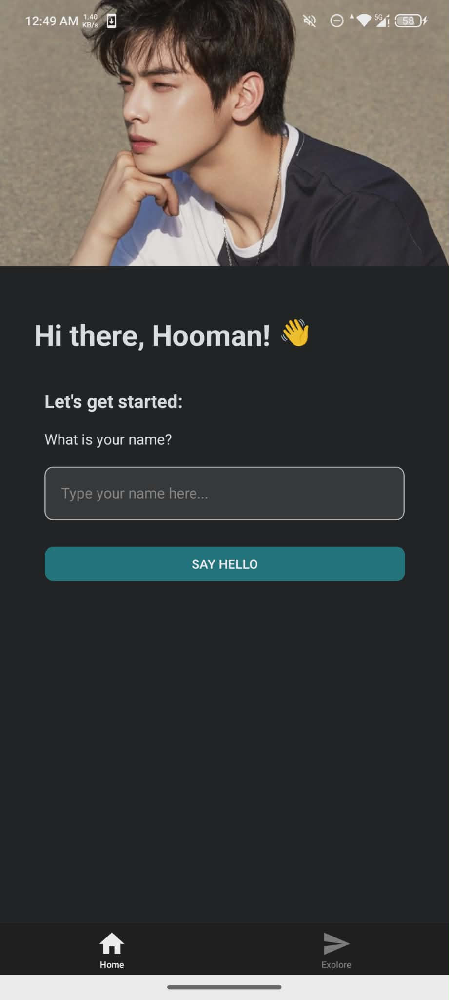
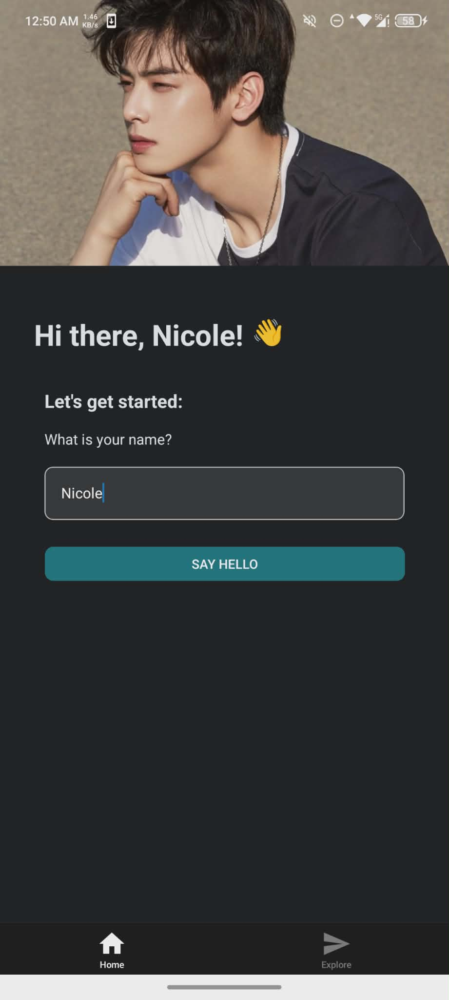
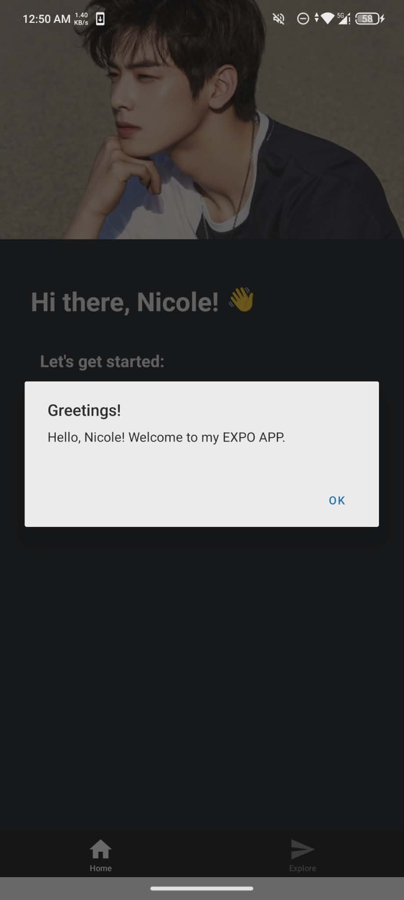
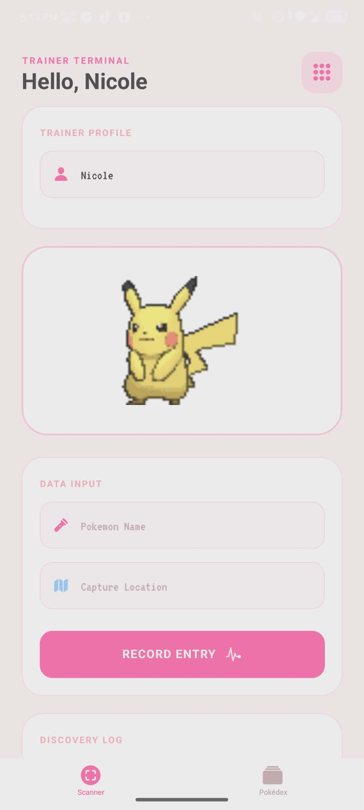
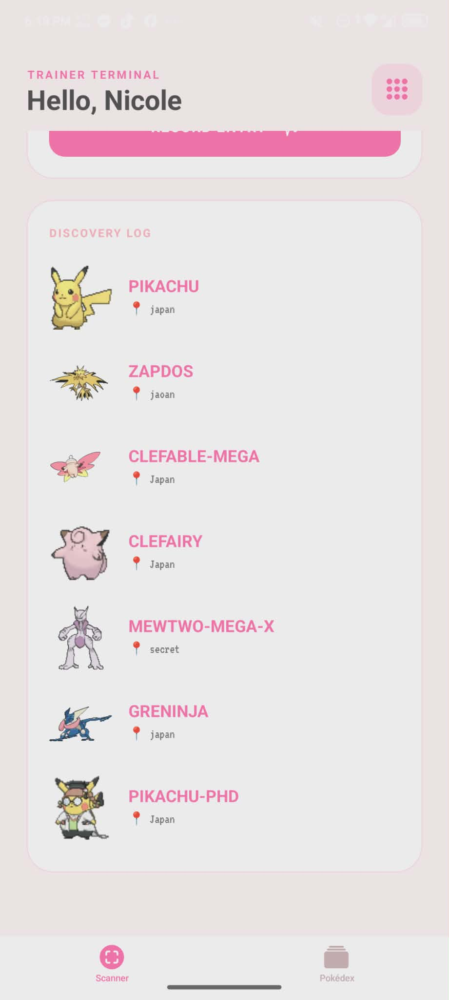
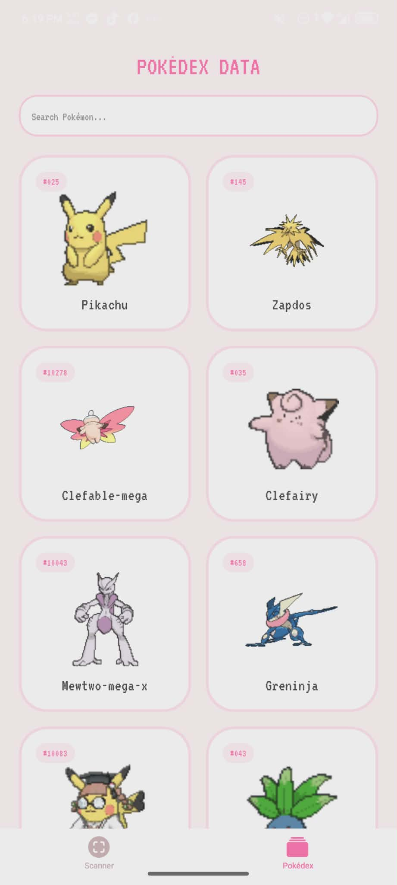
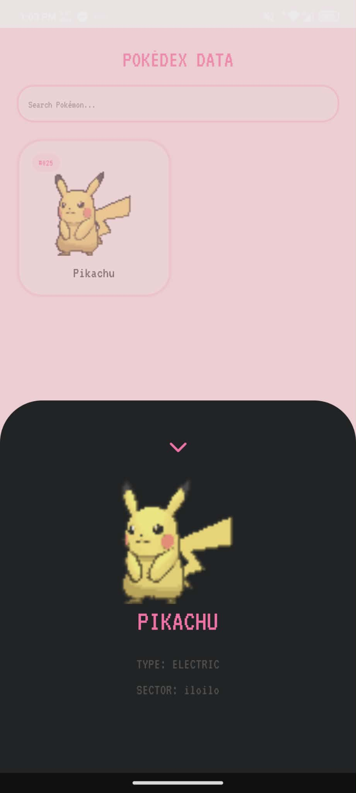

# 🚀 Project: Hello Expo!

<div align="center">


### ✨ _A personalized mobile experience built with React Native & Expo_

<br>

[](https://expo.dev/)
[](https://reactnative.dev/)


</div>

---

## 📖 Overview

> **Hello Expo** is a sleek, interactive mobile application designed to demonstrate the power of **React Native components**.

This project moves beyond boilerplate code to feature:

✨ **Personalized Greetings**
Real-time state management that reacts as you type.

🖼️ **Custom Branding**
Integrated local assets and optimized image rendering via `expo-image`.

📱 **Interactive UI**
Custom-styled inputs and native alerts for a seamless user experience.

🌊 **Parallax Effects**
A beautiful scrolling header that stays engaged with the user.

---

## 📸 App Preview for Step 5 Mission

<div align="center">





</div>

<p align="center">
  <strong>Clean • Modern • Responsive</strong>
</p>

---

## 📸 App Preview for Level Up Challenge

<div align="center">






</div>

<p align="center">
  <strong>⚡ Level Up Challenge: MINI POKEDEX</strong>
</p>

---

# 🚀 Getting Started

Follow these steps to get the app running on your **local machine** or **physical device**.

---

## 1️⃣ Clone & Enter

```bash
git clone https://github.com/your-username/cis228-hello-expo.git
cd cis228-hello-expo
```

---

## 2️⃣ Install the Dependencies

```bash
npm install
```

---

## 3️⃣ Launch the App

```bash
npx expo start
```

---

## 4️⃣ Scan and Enjoy!

📱 **Android / iOS**

Open the **Expo Go** app and scan the QR code displayed in your terminal.

💻 **Web**

Press:

```
w
```

in the terminal to open the project in your browser.

---

<div align="center">

✨ **Happy Coding with Expo!**

</div>
